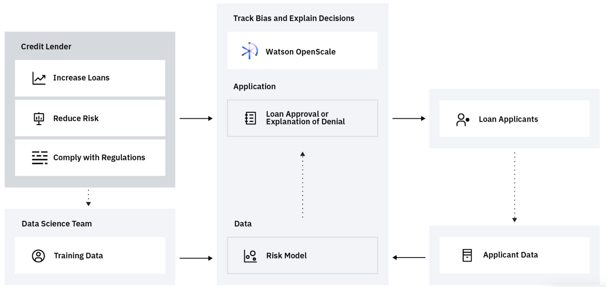

# Introduction

## Trust in AI

Fairness, robustness, and explainability are key attributes of trusted AI

### Watson OpenScale

Watson OpenScale tracks and measures outcomes from your AI models, and helps ensure they remain fair, explainable and compliant wherever your models were built or are running. OpenScale is designed as an open platform that will operate with various model development environments and various open source tools, including TensorFlow, Keras, SparkML, Seldon, AWS SageMaker, AzureML and more. 

Watson OpenScale provides a set of monitoring and management tools that help you build trust and implement control and governance structures around your AI investments

## Lab Overview

The scenario we will use in this lab is around credit lending and risk. Lenders want to give more loans to a wider variety of customers. To do this lenders are turning to complex credit risk machine learning models \(sometimes black box models\) that help determine if those customers are eligible for a loan based on a variety of different features, such as credit history, age, number of dependents, application education, job title, etc. 

As credit risk models expand to use these alternate data sources, we introduce risk that the model may find some unexpected correlations in the data and become biased based on an applicant’s age, gender, or other personal traits. 

In this lab will walk through the process of creating this credit risk model and then monitoring the model to explore the different aspects of trusted AI. We will build/configure/explore the following topics:

* Monitoring the performance of a deployed production AI models.
* Evaluating and tracking model quality \(accuracy and other metrics\).
* Determining and correcting bias that may be exhibited in the model and/or present in the training data.
* Generating detailed explanations for individual model transaction.
* Tracking the robustness of the model to alert for drifts in data or accuracy.

