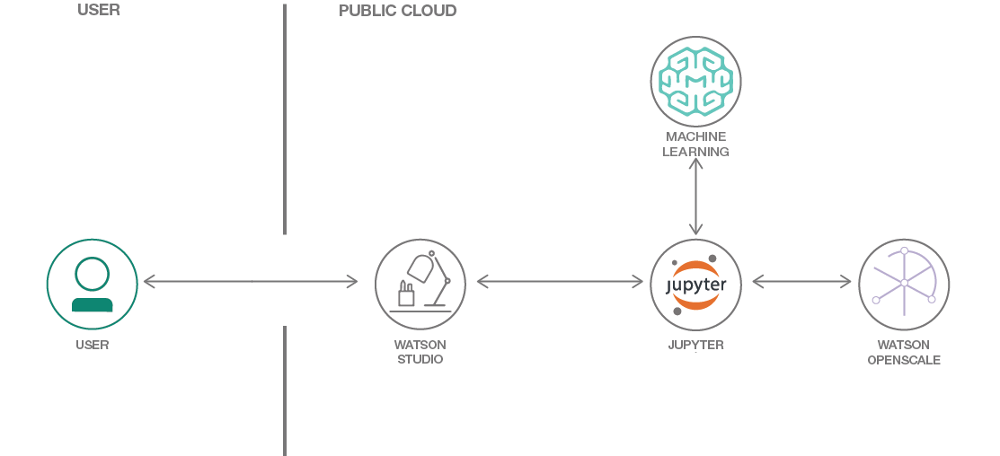

# Introduction

## Trust in AI

### Watson OpenScale

Watson OpenScale tracks and measures outcomes from your AI models, and helps ensure they remain fair, explainable and compliant wherever your models were built or are running.

## Lab

In this lab, you will be building a machine learning model in Watson Studio and then deploying that model to the Watson Machine Learning service. You will then enable and explore the different model characteristics you can monitor using Watson OpenScale.  

