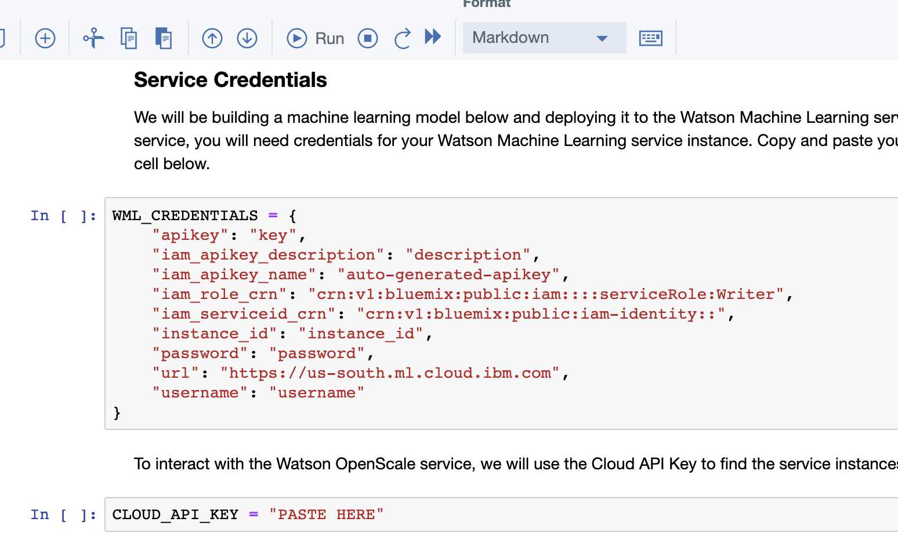
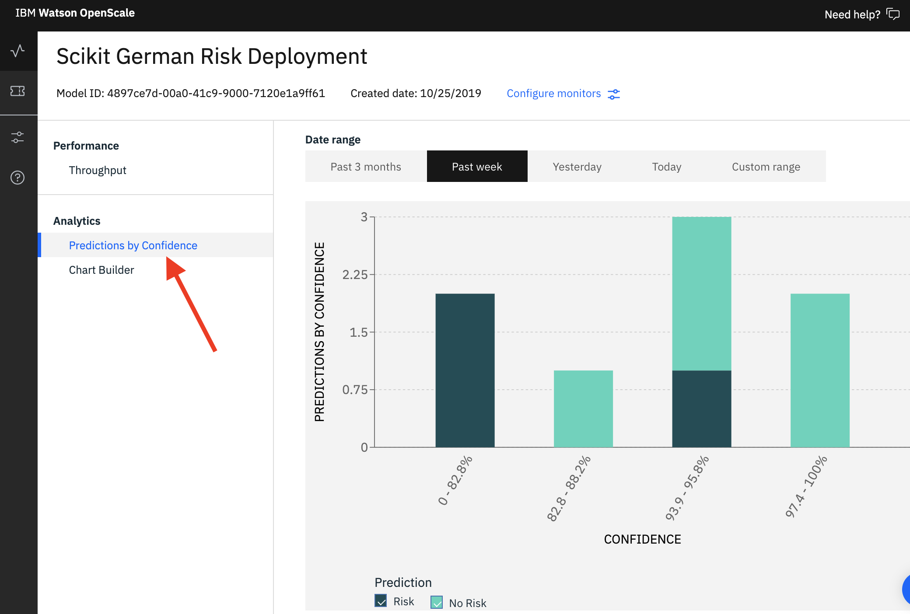

# Build Model & Configure Watson OpenScale


Although this lab is showing the end to end process of building, deploying, and monitoring/managing a machine learning model. Models do not have to be built in Watson Studio nor deployed to Watson Machine Learning to be monitored with OpenScale.   Watson OpenScale is an open platform that can manage production models in a variety of environments. See resources in the [Wrap-up section ](wrap-up.md)for examples of other models or deployment environments. 



**Note**: We are using the python client to interact with Watson OpenScale. The configuration down below can also be accomplished through the web interface or the REST APIs.


## Model Creation Notebook

The first notebook in the project you imported will create a model and configure OpenScale to start monitoring that model.

### 1.1 Open Notebook

* In [Watson Studio](https://dataplatform.cloud.ibm.com), select the project that you previously imported and click on the 'Assets' tab on the top of the project page.

* _**Click**_ on the model creation/configuration notebook \(_notebook name is prefixed with "1-"_ \) and then click on the pencil icon to enable you to edit / run the notebook.


_The project may have multiple model creation notebooks that build models using different libraries / algorithms. For this lab, select the Spark model - 1-sparkmlmodel-wos-configuration._


### 1.2 Update Credentials

* After the notebook environment starts up, scroll down to the section titled _**'Service Credentials'**_.  Copy and Paste the Watson Machine Learning service credentials and the Cloud API Key that you saved to a text editor earlier.

### 1.3 Run Notebook

* Go back to the first cell in the notebook and run the notebook. You can run the cells individually by clicking on each cell and then click the `Run` button at the top of the notebook. 


While the cell is running, an asterisk \(`[*]`\) will show up to the left of the cell. When that cell has finished executing a sequential number will show up. Generally, you want to wait until the cell finished executing before running the subsequent cells.

Alternatively, you can elect to run all the cells by clicking the **'Run All'** option under the **'Cell'** menu



By the end of the notebook, you should have a model created and deployed. With an online endpoint you can use the submit scoring requests. You will also have set up a subscription from OpenScale to the model.


## Explore the Watson OpenScale UI

Now that you have created a machine learning model and configured OpenScale, you can utilize the OpenScale dashboard to monitor the model. Although we have not enabled any type of monitoring yet, with the deployment approach we are using for this lab \( Watson Machine Learning as the model engine \), we will be able to see payload and some performance information out of the box.

* Open the [Watson OpenScale dashboard](https://aiopenscale.cloud.ibm.com) \([https://aiopenscale.cloud.ibm.com](https://aiopenscale.cloud.ibm.com)\) in the same browser \(but separate tab\) as you used to run the Watson Studio notebook. 
* When the dashboard loads, _**Click**_ on the _**'Model Monitors'**_  tab and you will see the one deployment you configured in the previous section.


Do not worry if the name you see does not match exactly with the screenshot. The deployment name you see will correspond to the variable used in the Jupyter notebook


### 2.1 Throughput

* From the 'Model Monitors' tab, click on the deployment you have created. You will see a graph of average throughput

* Click on the bar in the throughput graph and you will be able to find the actual transactions \(if you executed the cells of the notebook in the previous section only once, you would see just the 8 scoring requests we made after enabling the subscription\).

### 2.2 Confidence Distribution

You can also use the OpenScale dashboard to visualize the confidence of the models predictions. 

* Click on the _**'Predictions by Confidence'**_ option on the left panel.
* You will see the number of 'Risk' and 'No Risk' predictions for each confidence range.


If you see payload information you have successfully subscribed Watson OpenScale to the deployed machine learning model. You're ready to continue to the next section to enable different model monitors.


