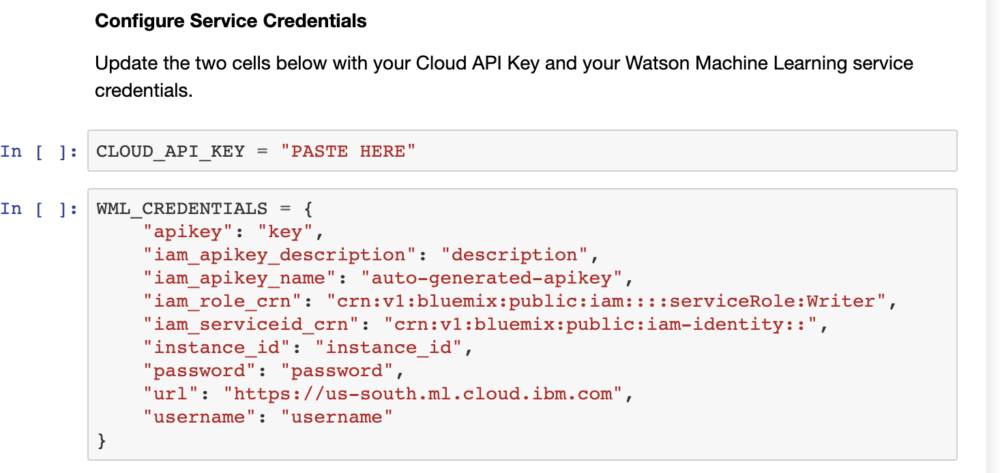
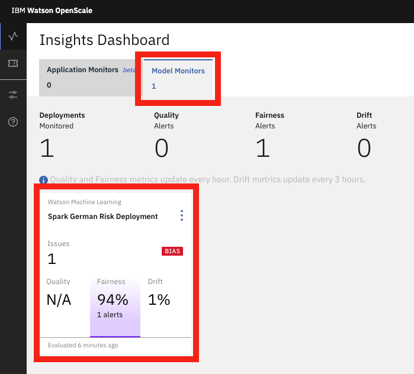
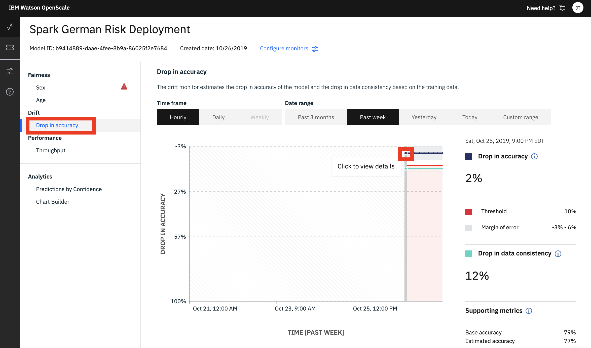

# Fairness, Drift and Explainability

## Fairness, Drift and Explainability Notebook

The second notebook in the project you imported will now enable these three capabilities in the subscription.

### 1.1 Open Notebook

In [Watson Studio](https://dataplatform.cloud.ibm.com), select the project that you previously imported and click on the 'Assets' tab on the top of the project page.

Under the 'Notebooks' section, _**Click**_ on the _**'2-fairness-drive-explainability-monitors'**_ notebook and then click on the pencil icon to enable you to edit / run the notebook.

### 1.2 Update Credentials

After the notebook environment starts up, scroll down to the section titled _**'Service Credentials'**_.  Copy and Paste the Watson Machine Learning service credentials and the Cloud API Key that you saved to a text editor earlier.

### 1.3 Run Notebook

Go back to the first cell in the notebook and run the notebook. You can run the cells individually by clicking on each cell and then click the `Run` button at the top of the notebook. 


While the cell is running, an asterisk \(`[*]`\) will show up to the left of the cell. When that cell has finished executing a sequential number will show up. Generally, you want to wait until the cell finished executing before running the subsequent cells.

Alternatively, you can elect to run all the cells by clicking the **'Run All'** option 


## Explore the Watson OpenScale UI

### 2.1 Check Model Fairness

The fairness monitor scans the requests sent to your model deployment \(i.e the payload\) to ensure fair outcomes across different populations. In this lab, we configured the fairness monitor for the 'Sex' and 'Age' attributes. 

Open the [Watson OpenScale dashboard](https://aiopenscale.cloud.ibm.com) \([https://aiopenscale.cloud.ibm.com](https://aiopenscale.cloud.ibm.com)\) in the same browser \(but separate tab\) as you used to run the Watson Studio notebook. When the dashboard loads, _**Click**_ on the _**'Model Monitors'**_  tab and you will see the one deployment you configured in the previous section.

We see there is an alert that the model is exhibiting bias. In this case, we have gone beyond the threshold we set to specify an acceptable difference between the percentage of Favorable outcomes for the Monitored group as compared to the percentage of Favorable outcomes for the Reference group \(Favorable % for monitored group / Favorable % for reference group \* 100 \)

_**Click**_ on the tile for the model deployment to view details for the deployment. 

You can see the fairness threshold is not met for the 'Sex' attribute.  We are monitoring a female group for fairness by comparing it to the male group \(the reference group\)

* On the right panel, under ‘ fairness score for Sex’. The fairness score is calculated by comparing 'No Risk' predictions for the female group compared to the male group. You can also see when the last evaluation was conducted.
* On the graph we can see fairness over time \(which is calculated hourly as predictions are made by the model\).


You must exceed the minimum number of records in the payload table for the fairness calculations to run. If there is not enough new payload data, the graph will show metrics from the last successful evaluation.


#### 2.1.1 Fairness Alert Details

We can now dive deeper into the fairness alert, move your mouse pointer over the graph to one of the points below the red threshold line.

From the details page, we can see that the monitored group is receiving favorable outcomes 73%, while the reference group is at 78%. explore the views available:

* **'Payload + Perturbed'** radio button selected - Displays the fairness outcomes computed by using the actual payload + perturbed data \(synthesized data obtained by flipping the monitored values, male-to-female and female-to-male\).
* 'Payload' radio button selected - Displays the payload data the model received for the selected hour.
* 'Training' radio button selected - Displays the records used to train the model
* 'Debiased' radio button selected - Displays the Payload + Perturbed data set after applying the Watson OpenScale debiasing algorithm. We can also access the debiased model that was automatically created by OpenScale. 
  * The **after** accuracy is computed by taking feedback data and sending it to the active debiasing API.
  * The **before** accuracy is computed by taking feedback data and sending it to the production model.


Watson OpenScale supports bias detection for models using structured data in its feature vector. It requires scoring requests to be logged, which is automatic for Watson Machine Learning engines.


#### 2.1.2 Transaction Explanation

A powerful feature for OpenScale is the ability to provide an explanation for why a model made a particular prediction.

_**Click**_ on the 'Explain a transaction' icon on the left panel and enter one of the transaction IDs printed in the last cell of the Jupyter notebook you ran in the prior section.


You can also explain the transactions associated to the fairness metrics, by clicking on the **View transactions** button in the fairness details chart.


From the transaction explanation page, you can see a breakdown of the features contributing to either "Risk" or "No Risk" outcome. We can also see advanced explanations, which show:

* The minimum set of changes in feature values to generate a different prediction. Each feature value is changed so that it moves towards its median value in the training data.
* The maximum changes that can occur in feature values that will not cause the prediction to change. Each feature value is changed so that it moves towards its median value in the training data.


Advanced explanations are not available for regression, image, and unstructured text models.


#### 2.2 Check Model Drift

Watson OpenScale analyzes transactions to detect drift in model accuracy as well as drift in data. It then groups these transactions 

* Drift in model accuracy happens if there is an increase in transactions that are similar to those that the model did not evaluate correctly in the training data. 
* Drift in data estimates the drop in consistency of the data at runtime as compared to the characteristics of the data at training time.

_**Click**_ on the _**'Drop in accuracy'**_ option on the left panel to show the model drift visualization.

* We can see the model has an estimated drop of 2% and that 12% of the transaction data \(scoring requests\) are inconsistent compared to the training data.

_**Click**_ on a data point in the 'Drop in accuracy' graph \(blue line in screenshot above\) to view drift details.

 From here you can explore the transactions that lead to drift in accuracy as well as drifts in data consistency.


It may take some time to generate transaction explanations. 



Drift is supported for structured data only and regression models only support data drift.


