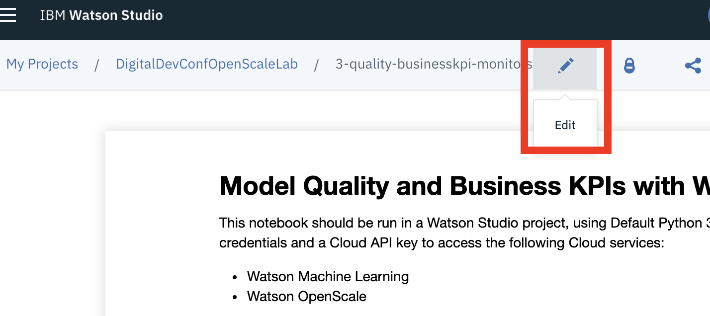
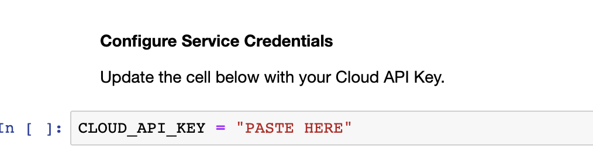
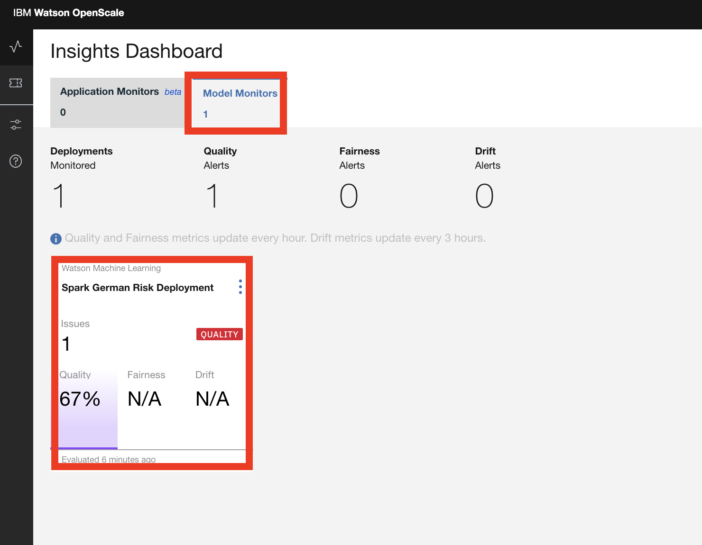
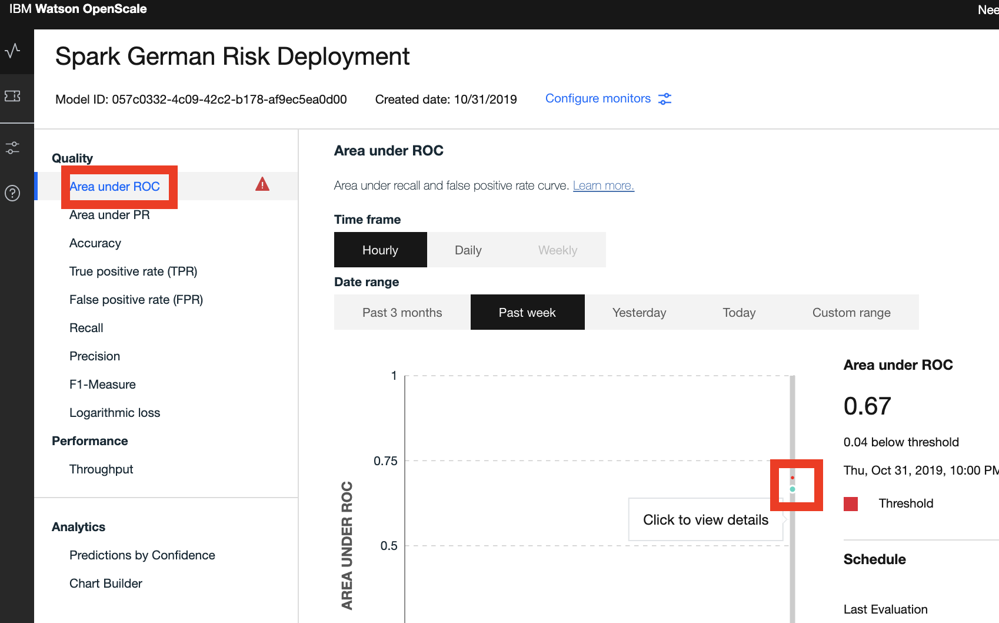
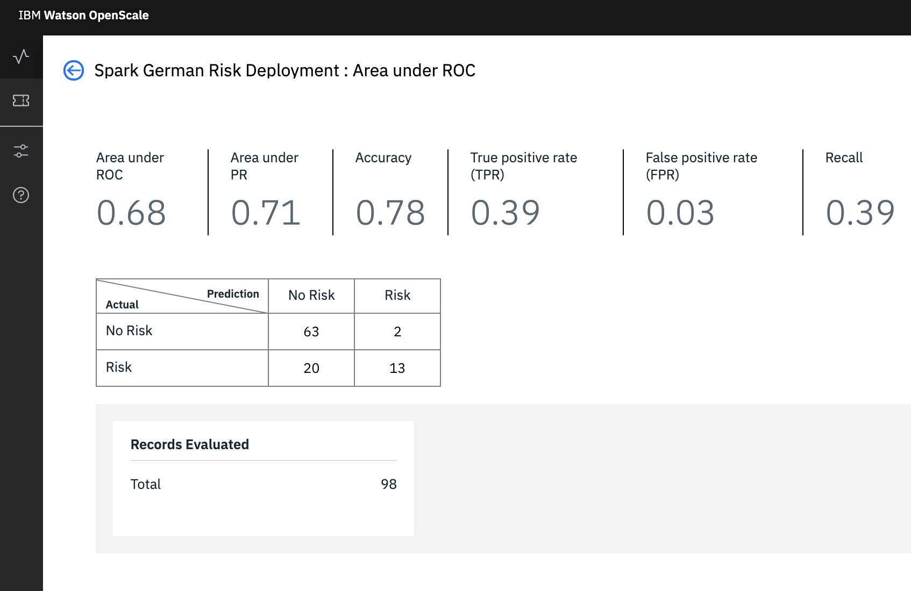

# Quality and Explainability

## Quality and Explainability Notebook

Quality \(performance\) monitors allow users to track performance of production AI and its impact on business goals. We will use a Jupyter notebook in the project you imported to enable these additional capabilities in the subscription. 

### 1.1 Open Notebook

* In [Watson Studio](https://dataplatform.cloud.ibm.com), select the project that you previously imported and click on the 'Assets' tab on the top of the project page.
* Under the 'Notebooks' section, _**Click**_ on the _**'quality-explainability-monitors'**_ notebook and then click on the pencil icon to enable you to edit / run the notebook.

### 1.2 Update Credentials

After the notebook environment starts up, scroll down to the section titled _**'Configure Service Credentials'**_.  Copy and Paste the Watson Machine Learning service credentials and the Cloud API Key that you saved to a text editor earlier.

### 1.3 Run Notebook

Go back to the first cell in the notebook and run the notebook. You can run the cells individually by clicking on each cell and then click the `Run` button at the top of the notebook. 


While the cell is running, an asterisk \(`[*]`\) will show up to the left of the cell. When that cell has finished executing a sequential number will show up. Generally, you want to wait until the cell finished executing before running the subsequent cells.

Alternatively, you can elect to run all the cells by clicking the **'Run All'** option 


## Explore the Watson OpenScale UI

### 2.1 Check Model Quality

The quality monitor scans the requests sent to your model deployment \(i.e the payload\) to let you know how well your model predicts outcomes. Quality metrics are calculated hourly, when OpenScale sends manually labeled feedback data set to the deployed model. 

* Open the [Watson OpenScale dashboard](https://aiopenscale.cloud.ibm.com). 
* When the dashboard loads, _**Click**_ on the _**'Model Monitors'**_  tab and you will see the one deployment you configured in the previous section.

* We now have an alert on the Quality of the model. 
* _**Click**_ on the deployment tile to open the details page and then _**Click**_ on the _'Area under ROC'_  option on the left panel. 
* We have set a threshold of 70% and based on the feedback data loaded in the notebook, the model is performing below that threshold.

* Feel free to explore the other quality metrics for the model. **Click** on the blue dot \(which represents the quality run we initiated from the Jupyter Notebook\), to view more details for a particular point on the performance graph.

