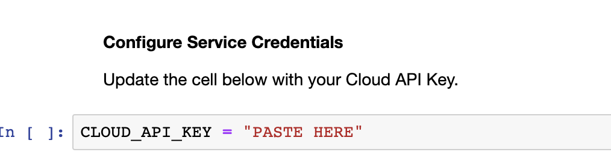

# \[Optional\] Application Monitor

### Enable Application Monitor

### 1.1 Open Notebook

* In [Watson Studio](https://dataplatform.cloud.ibm.com), select the project that you previously imported and click on the 'Assets' tab on the top of the project page.
* Under the 'Notebooks' section, _**Click**_ on the _**'application-custom-monitors'**_ notebook and then click on the pencil icon to enable you to edit / run the notebook.

### 1.2 Update Credentials

After the notebook environment starts up, scroll down to the section titled _**'Configure Service Credentials'**_.  Copy and Paste the Cloud API Key that you saved to a text editor earlier.

### 1.3 Run Notebook

* Go back to the first cell in the notebook and run the notebook. You can run the cells individually by clicking on each cell and then click the `Run` button at the top of the notebook. 


While the cell is running, an asterisk \(`[*]`\) will show up to the left of the cell. When that cell has finished executing a sequential number will show up. Generally, you want to wait until the cell finished executing before running the subsequent cells.

Alternatively, you can elect to run all the cells by clicking the **'Run All'** option 


* Explore the charts / visualizations in the notebook.

## Explore the Watson OpenScale UI

* Open the [Watson OpenScale dashboard](https://aiopenscale.cloud.ibm.com). 
* When the dashboard loads, _**Click**_ on the _**'Application Monitors'**_  tab and you will see the one deployment you configured in the previous section.

* Click on the 'Credit Risk Application' tile to see the see the performance of the two business KPIs we created

