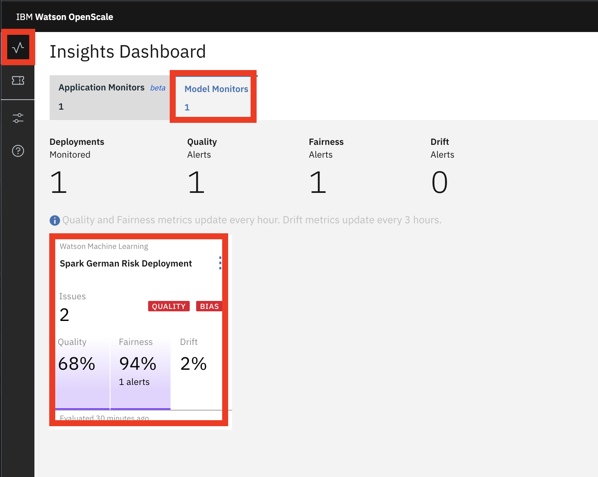
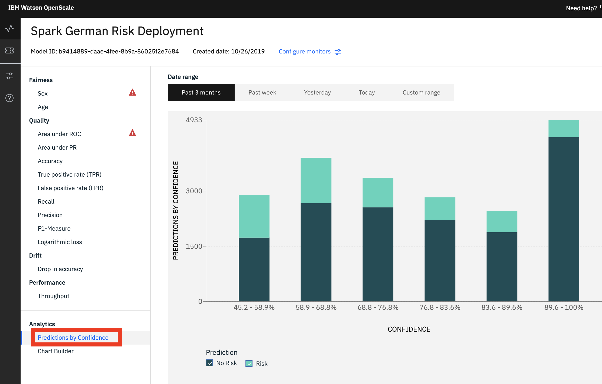
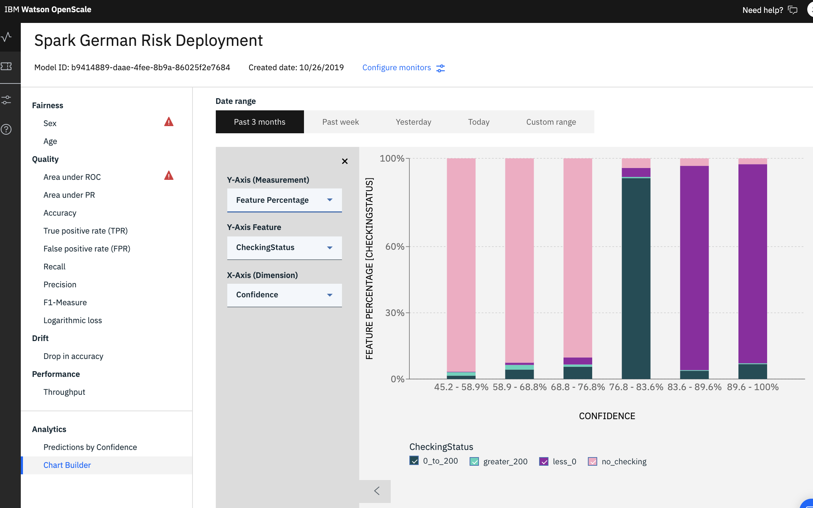
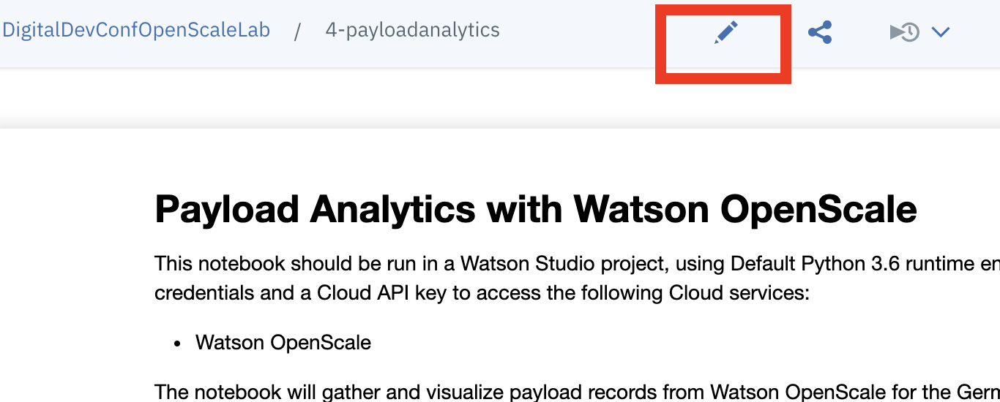

# \[Optional\] Payload Analytics

## Explore payload analytics

OpenScale gather the input received by the model it is monitoring as well as the predictions made by the model. This payload data contains all the feature values for the actual scoring requests, as well prediction values and associated probabilities. The payload data allows users to explore model behavior over time. Which can be done programmatically or through the web interface.

### Build a payload chart

Open the [Watson OpenScale dashboard](https://aiopenscale.cloud.ibm.com) \([https://aiopenscale.cloud.ibm.com](https://aiopenscale.cloud.ibm.com)\) in the same browser \(but separate tab\) as you used to run the Watson Studio notebook. When the dashboard loads, _**Click**_ on the _**'Model Monitors'**_  tab and you will see the one deployment you configured in the previous section.

Under the Analytics title, _**Click**_ on the 'Predictions by Confidence' option to display the confidence distribution of the models predictions. This view can be used to determine if there are low confidence predictions that may need to be investigated.


You may have to change the Date range to see data in the graph.


_**Click**_ on the 'Chart Builder' option on the left panel and use the following values to build a chart:

* For Y-Axis \(Measurement\), select: Feature Percentage
* For Y-Axis Feature, select: CheckingStatus
* For X-Axis \(Dimension\), select: Confidence

From this example, we can see that confidence of the model is lower when the feature CheckingStatus is 'no\_checking'. This may serve as an indicator to further inspect and validate payload records with this same status.

### Explore Payload Analytics Programmatically

### 1.1 Open Notebook

In [Watson Studio](https://dataplatform.cloud.ibm.com), select the project that you previously imported and click on the 'Assets' tab on the top of the project page.

Under the 'Notebooks' section, _**Click**_ on the _**'4-payloadanalytics'**_ notebook and then click on the pencil icon to enable you to edit / run the notebook.

### 1.2 Update Credentials

After the notebook environment starts up, scroll down to the section titled _**'Configure Service Credentials'**_.  Copy and Paste the Cloud API Key that you saved to a text editor earlier.

### 1.3 Run Notebook

Go back to the first cell in the notebook and run the notebook. You can run the cells individually by clicking on each cell and then click the `Run` button at the top of the notebook. 


While the cell is running, an asterisk \(`[*]`\) will show up to the left of the cell. When that cell has finished executing a sequential number will show up. Generally, you want to wait until the cell finished executing before running the subsequent cells.

Alternatively, you can elect to run all the cells by clicking the **'Run All'** option 


## 

