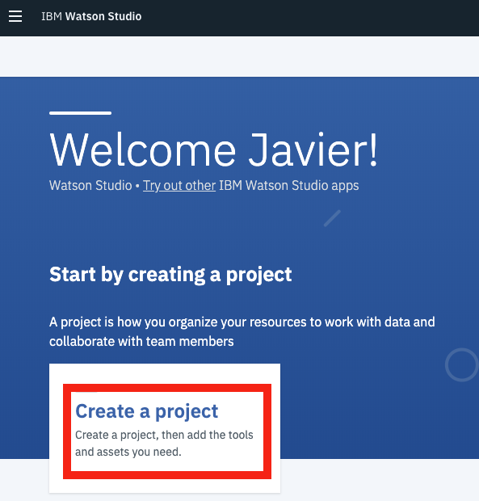

# Project Setup

## Import Project

1. Open your web browser and proceed to Watson Studio - [https://dataplatform.ibm.com](https://dataplatform.cloud.ibm.com) \(login if necessary\)
2. From the home page, click on the _**Create a Project**_ card   
3. 

