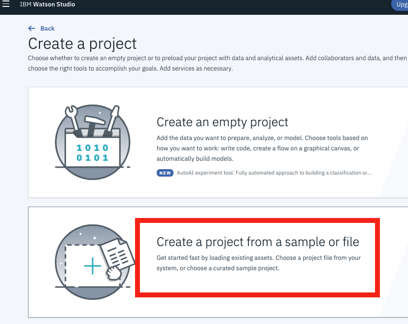
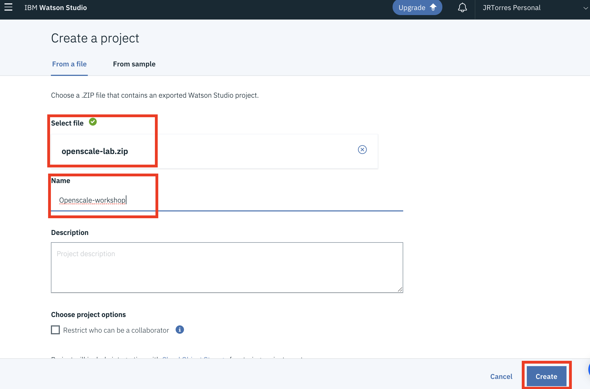
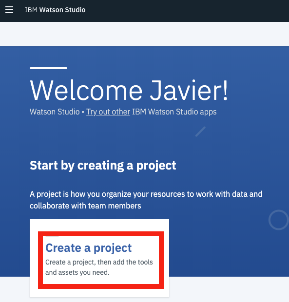

# Project Setup

## Import Project

1. Open your web browser and proceed to Watson Studio - [https://dataplatform.ibm.com](https://dataplatform.cloud.ibm.com) \(login if necessary\)
2. From the home page, click on the _**Create a Project**_ card    
3. Select the _**Create a project from a sample or file**_ option 
4.  
5. Browse for the project zip file you downloaded earlier and provide a name for the new project \(i.e. _OpenScale-workshop_\)   

1.d

1.adsf

