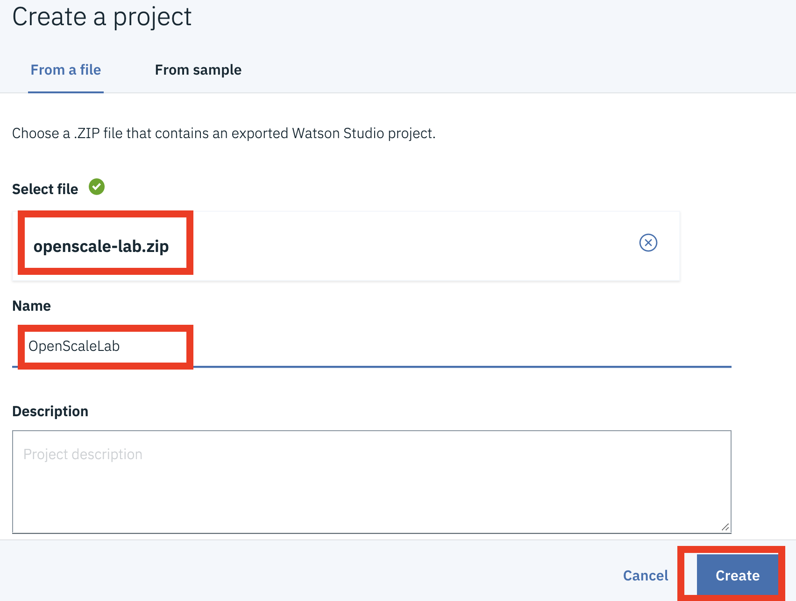

# Project Setup

## Download Project

Download the following zip file: 



## Import Project

1. Open your web browser and proceed to [Watson Studio](https://dataplatform.ibm.com) \(login if necessary\)
2. From the home page, click on the _**Create a Project**_ card     
3. Select the _**Create a project from a sample or file**_ option 
4.  
5. Browse for the project zip file you downloaded earlier and provide a name for the new project \(i.e. _OpenScale-workshop_\)    
6. Once the import completes, click on the _**'View new project'**_ button and proceed to the next lab section.

