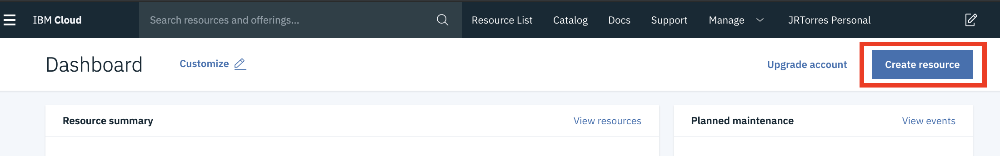

# IBM Cloud Services

We will be using several services in this workshop.   
1. `Watson Studio` - Platform to  
2. Watson Machine Learning  
3. Watson OpenScale

## Watson Studio and Cloud Object Storage

To provision these two services, follow these steps:

1. Open a browser window and navigate to: [https://dataplatform.cloud.ibm.com/registration/stepone?context=wdp&apps=all](https://dataplatform.cloud.ibm.com/registration/stepone?context=wdp&apps=all). 
2. Leave the _**'Dallas'**_  region selected.
3. Then provide your email address and "Create an IBM Cloud Account" or "Log in to activate Watson"
4. 

## Watson Machine Learning

