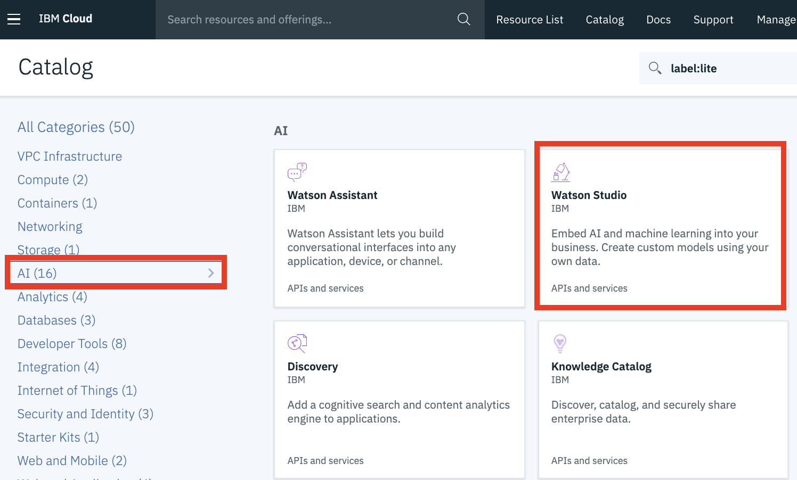
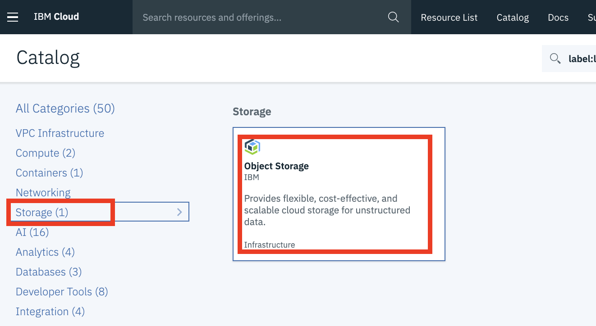
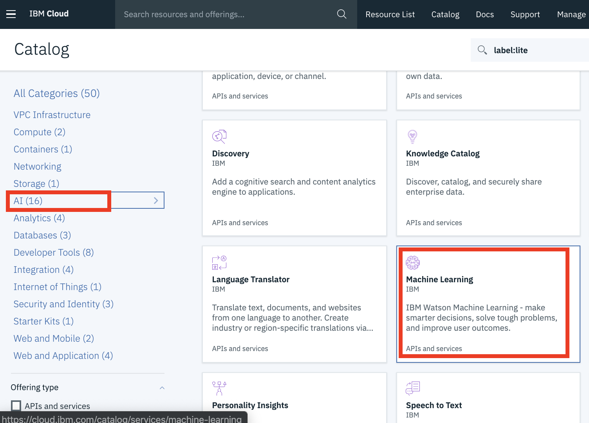
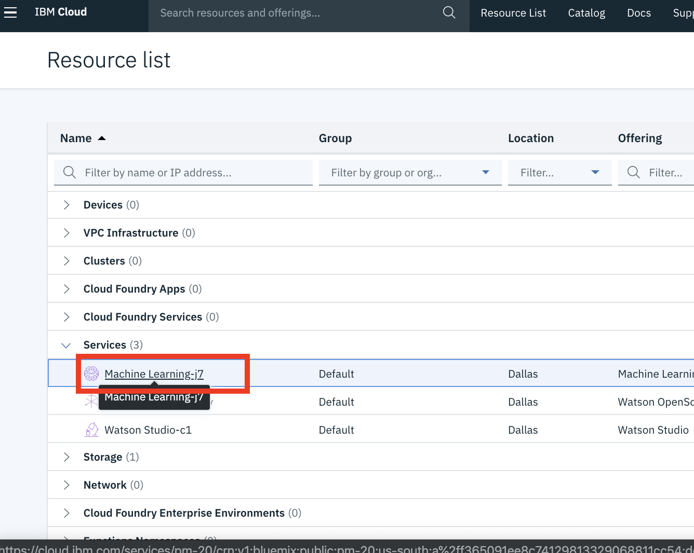
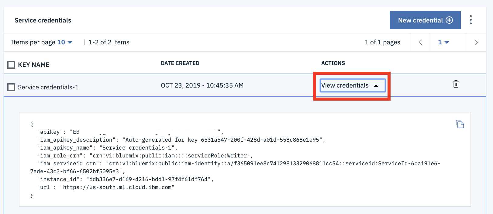
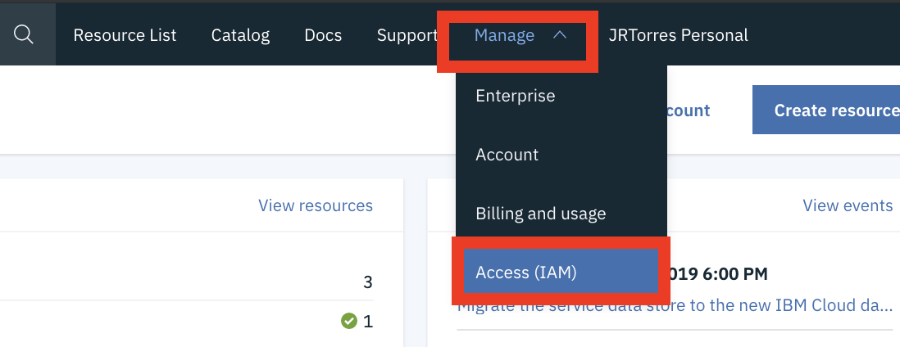
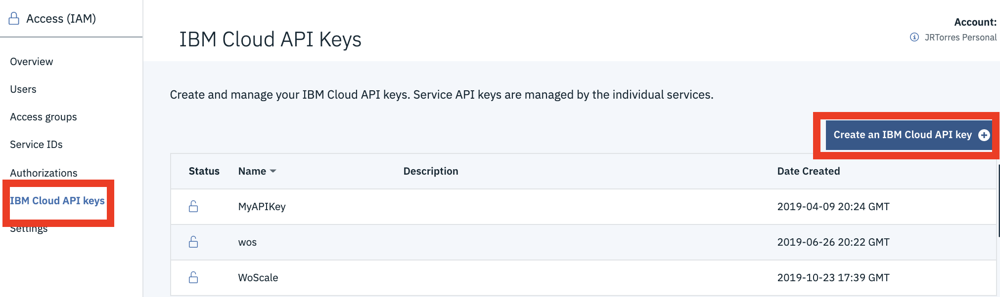

# IBM Cloud Services and Keys

## Watson Studio and Cloud Object Storage

Provision a Watson Studio service:

1. Login to [IBM Cloud](https://cloud.ibm.com)
2. From your Dashboard page, click on the _**'Create resource'**_ button   
3. Select the _**'AI'**_ filter from the left panel and then select the _**'Watson Studio'**_ tile   
4. Leave the _**'Dallas'**_  region and _**'Lite'**_  plan options selected and then click the _**'Create'**_ button

Now provision a Cloud Object storage service \(which Watson Studio uses to store content/assets\).

1. From your IBM Cloud Dashboard page, click on the _**Create resource**_ button   
2. Select the _**'Storage'**_ filter from the left panel and then select the _**'Object Storage'**_ tile    
3. Leave the default _**'Lite'**_  plan options selected and then click the _**'Create'**_ button

## Watson OpenScale

1. From the [IBM Cloud](https://cloud.ibm.com) Dashboard page, click on the _**'Create resource'**_ button   
2. Select the _**'AI'**_ filter from the left panel and then select the _**'Watson OpenScale'**_  tile   
3. Leave the _**'Dallas'**_  region and _**'Lite'**_  plan options selected and then click the _**'Create'**_ button

## Watson Machine Learning

1. From the [IBM Cloud](https://cloud.ibm.com) Dashboard page, click on the _**'Create resource'**_ button   
2. Select the _**'AI'**_ filter from the left panel and then select the _**'Machine Learning'**_  tile   
3. Leave the _**'Dallas'**_  region and _**'Lite'**_  plan options selected and then click the _**'Create'**_ button

**Service Key**

We will be deploying a model to this service using the Python SDK. To do that, we need to use the service credentials to instantiate the client. You can find the service credentials as follows:

1. From the [Resource List](https://cloud.ibm.com/resources), find and click on the Watson Machine Learning service you created for this lab   
2. _**'Click'**_ on the _'Service credentials'_ option on the left panel.
3. 'Click' on 'View credentials' under the Actions column.
4. Copy these credentials into a text editor. You will use them later in the lab.   


If you do not see any credentials when you click on the service, you can create a new set by clicking on the 'New credential' button.


## Cloud API Key

Finally, we will create a Cloud API key, which allows scripts to log in as your user identity. We will use this API key to get the Watson OpenScale service instance GUID and interact with that service. Follow the steps below to create the key:

1. From the [IBM Cloud](https://cloud.ibm.com) Dashboard page, click on the _**'Manage'**_ drop down menu and select the _**'Access \(IAM\)'**_ option.   
2. Click on the _**'IBM Cloud API Keys'**_ option from the left panel and then on the _**'Create an IBM Cloud API key'**_ button on the right.   
3. Give your key a name and then click the 'Create' button in the pop up window.
4. Copy the value of this API key into a text editor. You will use it later in the lab.


Be sure you copy the actual value of the key before closing the pop up window as you will not be able to see if after its closed.


