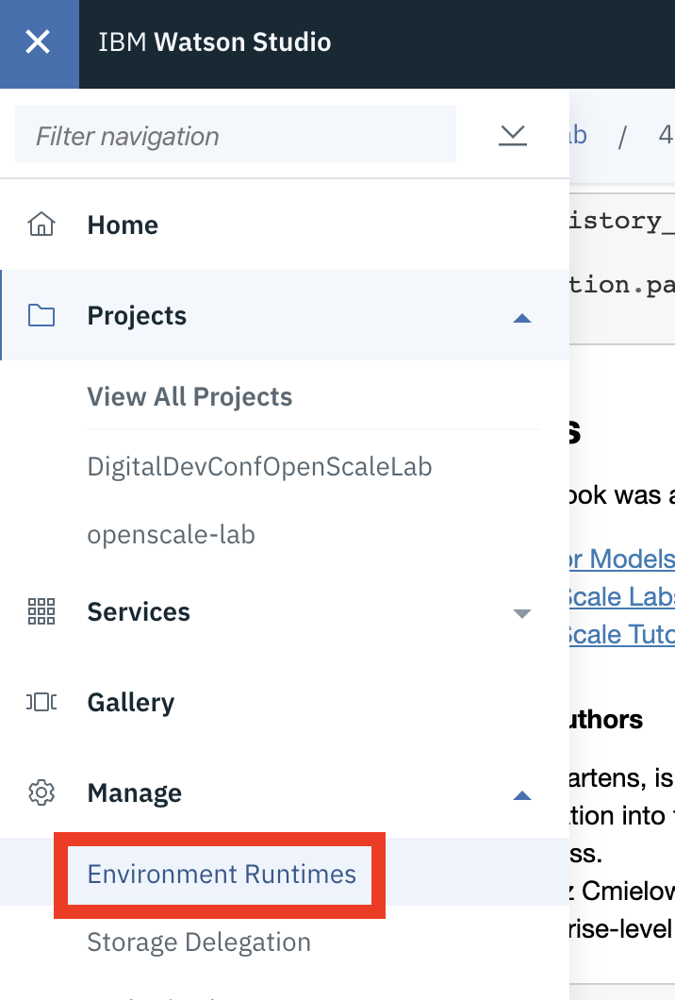
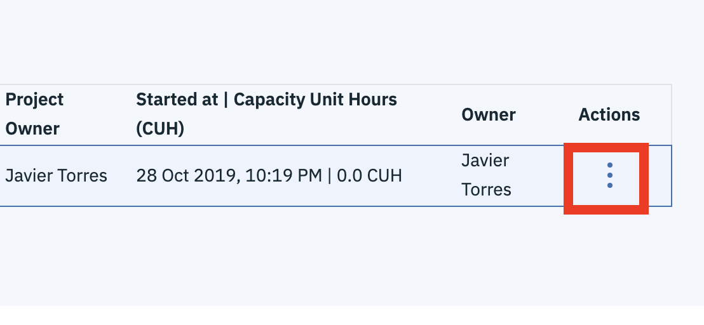

# Wrap-up

In this lab, we walked through the use of Watson OpenScale’s performance monitoring, bias mitigation and explainability features. Showing how these capabilities help to provide insight into model performance at runtime and can ultimately create more fair and explainable outcomes for customers. 

Below are some additional tips, resources and links you can explore.

## Shut Down Resources

If you used a Spark Python Jupyter kernel to run the lab, you can stop the environments to save capacity unit hours on your account

1. In the Watson Studio web interface. _**Click**_ on the three horizontal bars on the top left corner.
2. From the menu, expand the 'Manage section and select the **'Environment Runtimes'** option.   
3. Under the 'Active environment runtimes', if you see any running environments, you can shut them down by clicking on the three vertical dots under the 'Actions' column and selected the 'Stop' option    

## Additional Watson OpenScale Resources







#### Open-source Initiatives

* Trust in AI from IBM Research [https://www.research.ibm.com/artificial-intelligence/trusted-ai/](https://www.research.ibm.com/artificial-intelligence/trusted-ai/)
* [AI Fairness 360](https://www.ibm.com/blogs/research/2018/09/ai-fairness-360/) and [AI Explainability 360](https://www.ibm.com/blogs/research/2019/08/ai-explainability-360/). These free toolkits allow data scientists to identify potential issues with their models at build time.

